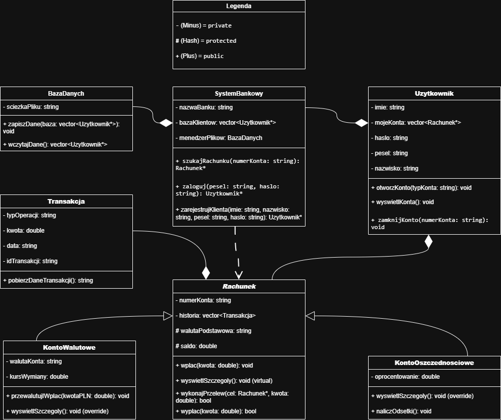

# 🏦 Symulator Systemu Bankowego

Projekt to konsolowa aplikacja w języku C++ symulująca działanie nowoczesnego systemu bankowego. Architektura aplikacji opiera się na paradygmatach programowania obiektowego (OOP), wykorzystując dziedziczenie, polimorfizm oraz hermetyzację danych.

## 👥 Zespół Projektowy
* Krystian Bielski
* Daniel Nurkowski
* Dawid Gargula
* Jakub Latos

---

## 🏗️ Architektura Systemu (Diagram UML)

Architektura została zaprojektowana z myślą o skalowalności i bezpieczeństwie. Poniższy diagram przedstawia strukturę klas i relacje między nimi:

---

## 🚀 Główne Moduły Systemu

Aplikacja składa się z następujących, zintegrowanych ze sobą podsystemów:
* **Baza danych użytkowników (Pliki Tekstowe)** - zarządzanie klientami w pamięci systemu z mechanizmem trwałego zapisu i odczytu danych (serializacja do plików `.txt`).
* **System kont użytkowników** - przypisywanie wielu rachunków do jednego klienta oraz bezpieczna nawigacja między nimi.
* **Typy kont i System rachunków bankowych** - obsługa polimorficzna kont specjalistycznych (Konto Oszczędnościowe z naliczaniem odsetek, Konto Walutowe).
* **System walutowy** - mechanizmy przeliczania walut i zarządzania kursami.
* **System przelewów** - realizacja płatności między różnymi rachunkami w systemie.
* **Historia transakcji** - zorganizowany rejestr operacji dla każdego rachunku, realizowany za pomocą dedykowanej klasy `Transakcja`.

---

## 🕹️ Możliwości Symulatora (Akcje Użytkownika)

Po uruchomieniu aplikacji, użytkownik ma do dyspozycji interaktywne menu konsolowe, pozwalające na:
1. Zalogowanie się do swojego profilu (lub rejestrację nowego klienta).
2. Otwieranie, zamykanie i wybór konkretnego rachunku.
3. Sprawdzanie aktualnego salda oraz szczegółów konta.
4. Wykonanie przelewu środków na inne konto (na podstawie numeru konta).
5. Zarządzanie oszczędnościami (naliczanie odsetek).
6. Przewalutowanie środków.

---

## 🗄️ Przechowywane Dane

W ramach profilu klienta i jego rachunków, system przetwarza następujące dane:
* **Dane osobowe:** Imię, Nazwisko.
* **Dane autoryzacyjne:** PESEL, Hasło dostępowe.
* **Dane finansowe:** Aktualne saldo przypisanych kont, waluta podstawowa, numery kont oraz kompletna historia transakcji (kwota, data, typ operacji, unikalne ID).
